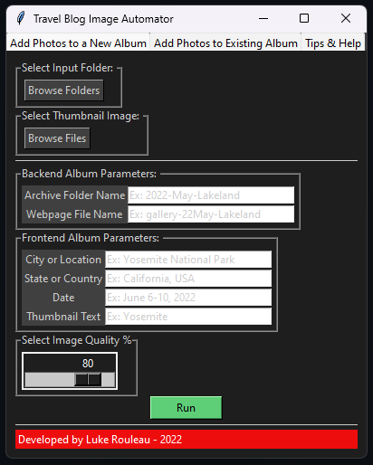
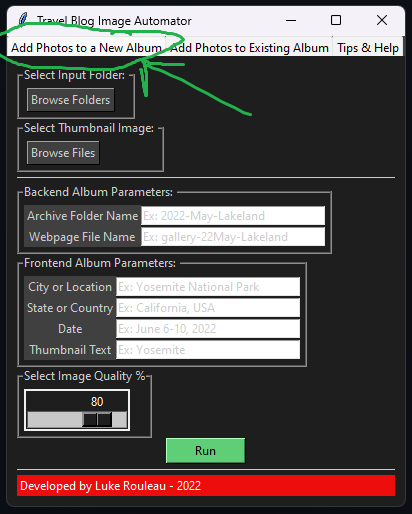
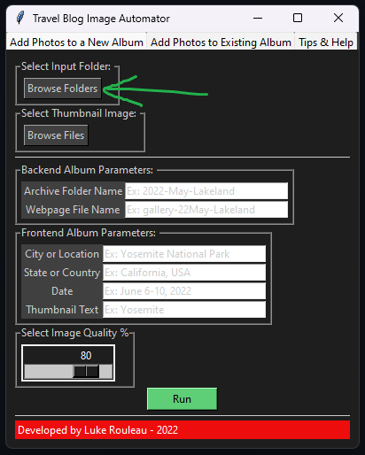
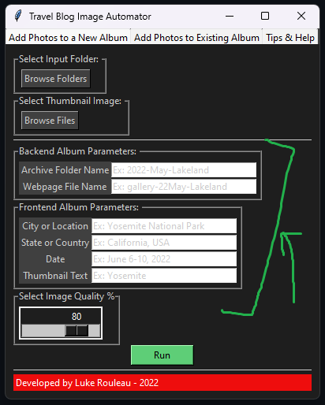

# A U T O M A T O R for P H O T O R A M A


The big addition that I have made to this repo is the addition of an automator tool that will make the process of adding new pictures to the gallery much faster and easier. 

## Directory Structure
  Relative to the root of this repo, the automator, ```automator.py```, lives here: ```./automator/automator.py```.
  The tool requires the directory structure of this repo, i.e., there must be a ```./gallery/archive/``` and a ```./gallery/albums/```
  
  - The album cover photos live in ```./gallery/albums/```
  - The photos in a specific album live in ```./gallery/archive/```
  - Within ```./gallery/``` lives a bunch of individual directories for each album following the naming convention ```gallery-YYMonth-AlbumName```. Inside of those directories lives the index.html file describing that album.
  
 
 ## What this tool does:
 ### Quickly and graphically create a new album.
  1. Use the Add Photos to a New Album tab
  
  
  
  2. Select a FOLDER in which are the photos you want to add to a new album
  
  
  
  3. Select a thumbnail IMAGE from that FOLDER
  
  
  
  4. Fill in all the fields to give you album an archive name, a page name, a city, a country, a date, and a thumbnail caption text. Preferred formatting, according to the, current naming convention of the tool is recommended in each field before you type.
  
  
  
  5. Select an image compression quality. I highly recommend 80%, the pictures look almost perfect with a decent size reduction. Otherwise, there's either major aliasing or the files are too big for decent loading speed.
  
  6. Hit run. This will do the following:
  - Copy a compressed version of your IMAGES into ```./gallery/archive/*ArchiveFolderName*```
  - Copy a compressed version of the thumbnail IMAGE into ```./gallery/albums/```
  - Create an index.html file within ```./gallery/*WebpageFileName*/``` that includes the necessary yaml links to all of the files copied into the archive folder.
  - Create the necessary yaml addition within ```./gallery/index.html``` so that the album is viewable from the gallery page.
    
  7. Now, just confirm in those modified files that the changes look right, commit, and push to this repo. Your website will update itself.
  
 ### Quickly and graphically add photos to an existing album.
  This tool follows the same premise, except it does not create any new files or directories, it just places the compressed versions of the files you want to upload into an existing album for you. 


-----------------------------------------------------------
p h o t o r a m a / VismayTravels
====================


----------

---> [DEMO](https://sunbliss.github.io/photorama/ "DEMO")  <---

----------

A theme for **jekyll**. 

Created for gh-pages (project page).

This template was crafted having in mind the photobloggers and the artists.

It uses [Clean Blog](https://github.com/BlackrockDigital/startbootstrap-clean-blog-jekyll "Clean Blog") as its basis.

----------
## Change Log

### Version 2.2 (4/23/2018)

<a href="https://github.com/sunbliss/photorama/wiki/How-to-get-SSL-on-Jekyll%3F"> How to get SSL Certificate (Https) For Jekyll</a>

### Version 2.1 (3/22/2017)

* Fixed script loading. 
* Fixed padding bottom for the navbar toggle menu.


### Version 2.0 (2/4/2017)

* HTTPS is now enforced. 

~~**Custom Domains are not supported.**~~

~~For the time being, the only way to apply a custom domain name is by removing HTTPS as of the previous version. 
Hoping Github developers will give its users the ability to add a custom domain served under security.~~

### Version 1.2 (1/31/2017)

* Fixed footer code so that the twitter icon links to the twitter_username instead of instagram_username.

### Version 1.1 (7/15/2016)

* Improved galleries and search section.
* Better rendering of the header text.

### Version 1.0 (6/19/2016)
* Initial Template

----------

 **IMPORTANT!!!**
================

### Before you begin: Change the URL and the BASEURL as well as the internal nav links in the _config.yml

The **URL** should say `https://yourusername.github.io`

The **BASEURL** should say `/repositoryname`

**Internal nav** should say

  nav:

  - GALLERY: `"https://yourusername.github.io/repositoryname/gallery/"`
  - JOURNAL: `"https://yourusername.github.io/repositoryname/journal/"`
  - ABOUT: `"https://yourusername.github.io/repositoryname/about/`"

If there are problems with loading assets like CSS files and images, make sure that both **URL** and **BASEURL** are set correctly!!! 

----------

~~**NOT FOR HTTPS served repos!!!**~~
==================================

~~* Applies for v1.2!~~

If you want to use your **own domain** go to the root of your project's repository, create a CNAME file and add a line with your domain name, e.g. `www.yourdomain.com`.

Go to your domain name registrar and add a CNAME record pointing your domain to GitHub Pages:
- type: CNAME
- host: www.yourdomainname.com
- answer: yourusername.github.io/repositoryname
- TTL: 300

----------

Usage
============ 

###Quick Start

1. [Fork this repository](https://github.com/sunbliss/photorama/fork) to get started. 
2. Go to `https://github.com/yourusername/photorama/settings`
3. Rename the repository to your new project, e.g. *myphotoblog*
2. Create a new branch called `gh-pages` in your repository. 
3. Go to the branches directory at `https://github.com/yourusername/repositoryname/branches` and *change* **default branch** to **gh-pages**.
4. Delete **master** branch. 
3. GitHub will build your site automatically and publish it at `https://yourusername.github.io/repositoryname/`.  

----------

- The homepage welcomes the visitors with 3 animated photos of your choice. It is recommended that all three are landscape orientated for best view.

To change the welcome content at the far left of the Home page go here: `/index.html` and fill the responding lines of the YAML with your desired text.

----------

- To enable **disqus** comments in the posts, change their front matter for comments to 'true'.

You must have a registered account in disqus, where you will also register a forum for your website.

Find the line `s.src = '//yourproject.disqus.com/embed.js';  // ` in the disqus_comments.html and REPLACE 'yourproject' with your forum shortname.

----------

- In order to send **newsletters** about your posts to your subscribers, you should register an account in [tinyletter](http://www.tinyletter.com " tinyletter").

Find the line `'https://tinyletter.com/yourproject', ` in the *newsletter.html* and replace 'yourproject' with your registered website.

You can always ommit the newsletter rendering by deleting the line `
` in the *default.html* layout.

----------

If you want to use the matching **NEWSLETTER** template, you must always create a new file  by copying its respective index.html and renaming it to e.g. 2016-March-newsletter.html and then save it inside the folder and the accompanying images inside the 'images folder', so it can be accessed to your viewers through their browser. In this case the root url for the above newsletter will be ***http://yourgithubusername.github.io/yourproject/2016-March-newsletter.html***. Copy this link and replace this part of the code `http://www.yoursite.com/newsletter/year-month-newsletter` with it.

----------

**TAGS** and **CATEGORIES** of the posts 

When you add a tag or a category name in the front matter of a post, don't forget to add the responding markdown files in /journal/tag/ folder and in /journal/category folder, so they can always render when browsing the journal or searching in the respective page.

----------

All the credits and the helpers can be found at **ABOUT** page.


----------

Read <a href="https://sunbliss.github.io/photorama/journal/images-size-for-better-performance/">**this**</a> post if you want to ensure your website always loads fast.


----------

I hope you will find it useful for your projects, photographic or not.


----------


##License

The MIT License (MIT)

Copyright (c) 2014 Filippo Oretti, Dario Andrei

Permission is hereby granted, free of charge, to any person obtaining a copy of this software and associated documentation files (the "Software"), to deal in the Software without restriction, including without limitation the rights to use, copy, modify, merge, publish, distribute, sublicense, and/or sell copies of the Software, and to permit persons to whom the Software is furnished to do so, subject to the following conditions:

The above copyright notice and this permission notice shall be included in all copies or substantial portions of the Software.

THE SOFTWARE IS PROVIDED "AS IS", WITHOUT WARRANTY OF ANY KIND, EXPRESS OR IMPLIED, INCLUDING BUT NOT LIMITED TO THE WARRANTIES OF MERCHANTABILITY, FITNESS FOR A PARTICULAR PURPOSE AND NONINFRINGEMENT. IN NO EVENT SHALL THE AUTHORS OR COPYRIGHT HOLDERS BE LIABLE FOR ANY CLAIM, DAMAGES OR OTHER LIABILITY, WHETHER IN AN ACTION OF CONTRACT, TORT OR OTHERWISE, ARISING FROM, OUT OF OR IN CONNECTION WITH THE SOFTWARE OR THE USE OR OTHER DEALINGS IN THE SOFTWARE.

